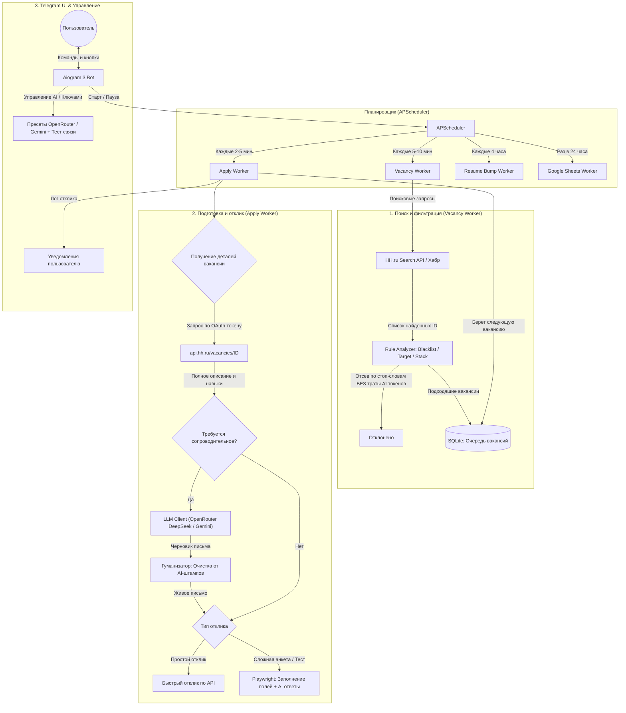

# 🏗 Архитектура и Устройство проекта (Как всё работает)

Этот документ объединяет техническую архитектуру, схему потоков данных и описание бизнес-логики бота. Он предназначен для разработчиков и пользователей, желающих детально понимать внутреннее устройство системы.

---

## 📌 Технологический стек

- **Язык и среда:** Python 3.12+ (полная асинхронность на базе `asyncio`).
- **Telegram UI:** `aiogram` (v3+) с использованием машины состояний (FSM) для интерактивной настройки параметров и ключей прямо в чате.
- **Интеграция с платформами вакансий:**
  - **HeadHunter:** Двухуровневая интеграция:
    1. Поиск вакансий через мобильное/публичное API.
    2. Извлечение детального описания и ключевых навыков через официальный API `api.hh.ru/vacancies/<id>` с авторизацией по OAuth Bearer токену (защита от блокировок Cloudflare и пустых HTML-страниц).
  - **Хабр Карьера:** REST API и парсинг.
  - **Автоматизация анкет и тестов:** `playwright` (Chromium) с инжекцией скриптов маскировки отпечатков браузера (anti-detect).
- **База данных:** `sqlalchemy[asyncio]` + `aiosqlite` (локальная легковесная SQLite-база с поддержкой конкурентного чтения).
- **Фоновые задачи:** `apscheduler` (асинхронный планировщик задач).
- **Конфигурация:** `pydantic`, `pydantic-settings` с валидаторами настроек и защитой от конфликтов моделей.
- **AI Интеграция:** 
  - 100% бесплатные LLM-провайдеры: **OpenRouter** (по умолчанию `deepseek/deepseek-v4-flash-0731:free`) и **Google Gemini** (бесплатный тариф Gemini Flash).
  - Поддержка рассуждающих моделей (thinking/reasoning fallback).
  - Увеличенный таймаут запросов (240 сек) для очередей бесплатных моделей.
  - Гуманизатор текста (Анти-ИИ) на базе алгоритмов очистки штампов (`digitaltraffic-detectai`).

---

## 🗺️ Схема работы (Workflow & Data Flow)

Ниже представлена детальная схема прохождения данных через подсистемы: от планировщика до отправки отклика и уведомления пользователя.

---

## 📂 Структура проекта (`hh-autoresponder/app/`)

* **`main.py`** — Главная точка входа. Инициализирует базу данных, настраивает и запускает планировщик фоновых процессов (`APScheduler`) и поллинг Telegram-бота (`aiogram`).
* **`config.py`** — Управление конфигурацией через `pydantic-settings`:
  - Загрузка переменных окружения из `.env`.
  - Независимое хранение ключей: `openrouter_api_key` и `gemini_api_key`.
  - Валидатор `@model_validator`: автоматическая защита конфигурации (предотвращает ошибочное использование моделей Gemini с эндпоинтом OpenRouter и фиксирует дефолт `deepseek/deepseek-v4-flash-0731:free`).
* **`database.py`** — Асинхронное подключение к SQLite (`aiosqlite` + `AsyncEngine`).
* **`models/`** — ORM-модели данных:
  - `vacancy.py`: сохраненные вакансии, рейтинг релевантности (скор стека), статус обработки.
  - `application.py`: журнал отправленных откликов, тексты сгенерированных писем, статусы работодателя.
  - `session.py`: хранение cookies и авторизационных данных.
* **`bot/`** — Слой взаимодействия с пользователем через Telegram:
  - `handlers.py`: обработчики команд `/start`, переключения режима автоотклика, интерактивное меню настройки нейросетей (`AISettingsSG`), ввод ключей с валидацией, запуск пинга (`ai_test_conn`).
  - `keyboards.py`: инлайн- и реплай-клавиатуры, динамический выбор моделей в зависимости от активного провайдера.
* **`parsers/`** — Модули взаимодействия с сайтами вакансий:
  - `hh.py`: поиск вакансий, получение детальной информации через официальный API `api.hh.ru/vacancies/<id>` по OAuth Bearer токену (с fallback на HTML-парсинг через BeautifulSoup), быстрый отклик по API.
  - `habr.py`: поиск и отправка откликов на Хабр Карьере.
  - `hh_playwright.py`: автоматизация браузера для решения сложных работодательских анкет и тестов.
  - `manual_login.py`: скрипт первичной авторизации пользователя через браузер для сохранения сессии и OAuth-токена.
* **`workers/`** — Фоновые задачи:
  - `scheduler.py`: инициализация и запуск расписаний задач.
  - `vacancy_worker.py`: плановый сбор и фильтрация свежих вакансий.
  - `apply_worker.py`: отправка откликов с рандомизированными задержками и проверкой суточного лимита.
  - `resume_bump_worker.py`: регулярное поднятие резюме в поиске hh каждые 4 часа.
  - `google_sheets_worker.py`: синхронизация истории откликов с Google Таблицей.
* **`ai/`** — Интеллектуальный слой:
  - `rule_analyzer.py`: детерминированная фильтрация вакансий по ключевым словам и стеку (без вызова LLM).
  - `claude.py`: асинхронный HTTP-клиент к OpenAI-совместимому API (OpenRouter и Gemini). Включает логику тестирования подключения `test_connection()`, расширенный таймаут 240 сек, поддержку рассуждающих моделей (reasoning fallback).
  - `humanizer.py`: пост-обработка сгенерированного текста (удаление ИИ-клише и неестественных конструкций).
* **`utils/`** — Вспомогательные утилиты (стелс-настройки браузера, генераторы случайных задержек).

---

## 🔬 Архитектура ключевых подсистем

### 1. Двухэтапный сбор и обогащение вакансий (Data Pipeline)
В отличие от примитивных парсеров, система разделяет процесс на два этапа:
1. **Быстрый поиск (Search API):** `Vacancy Worker` запрашивает списки вакансий по вашим ключевым фразам. Полученные карточки вакансий проверяются через локальный `Rule Analyzer`:
   - Если вакансия содержит стоп-слова из `NEGATIVE_KEYWORDS`, она немедленно отбрасывается (0 токенов потрачено).
   - Если стек совпадает с `TARGET_KEYWORDS`, вакансия сохраняется в БД в очередь на отклик.
2. **Обогащение данных через OAuth API:** Когда `Apply Worker` берет вакансию из очереди, бот выполняет запрос к `api.hh.ru/vacancies/<id>`, используя сохраненный OAuth Bearer токен из `data/hh_oauth_token.json`.
   - Это гарантирует получение полного текста описания, ключевых навыков и требований работодателя даже при блокировках Cloudflare на обычном сайте hh.ru.
   - ИИ получает исчерпывающий контекст для генерации письма высокой точности.

### 2. Бесплатный AI-слой и клиент нейросетей (`app/ai/claude.py`)
- **Единый OpenAI-совместимый интерфейс:** Клиент взаимодействует с эндпоинтами через стандартный протокол Chat Completions.
- **Поддержка двух провайдеров «из коробки»:**
  - **OpenRouter (по умолчанию):** Модель `deepseek/deepseek-v4-flash-0731:free`. 100% бесплатная, высокая скорость, отличное качество составления писем на русском языке.
  - **Google Gemini:** Прямой доступ к API Gemini через OpenAI-совместимый эндпоинт `https://generativelanguage.googleapis.com/v1beta/openai/`.
- **Поддержка рассуждающих моделей (Reasoning Parsing):**
  Некоторые модели (например, DeepSeek Flash / R1) возвращают ход мыслей в поле `message.reasoning`, а финальный ответ в `message.content`. Если `content` пуст, клиент автоматически извлекает ответ из `reasoning`.
- **Таймаут и устойчивость к пиковым нагрузкам:**
  Установлен таймаут `240.0` секунд на запросы к LLM, что исключает ошибки `ReadTimeout` при очередях на бесплатных шлюзах OpenRouter.
- **Встроенная самодиагностика (`test_connection`):**
  Метод отправляет короткий пинг-промпт и возвращает точное время ответа модели и статус авторизации ключа.

### 3. Гуманизатор текста (`app/ai/humanizer.py`)
Сгенерированное письмо передается в модуль гуманизации:
- Удаляются навязчивые шаблонные вступления («Меня зовут... и я с воодушевлением пишу вам...»).
- Удаляются искусственные канцеляризмы («Я обладаю обширным бэкграундом и глубокими компетенциями...»).
- Текст форматируется в лаконичном, профессиональном и уверенном тоне от первого лица.

### 4. Защита от обнаружения и антифрод
- **Динамический дневной лимит:** Каждый день генерируется случайное пороговое число откликов в интервале от `MIN` до `MAX`.
- **Рандомизированные задержки:** Паузы между шагами поиска и отправки варьируются в диапазоне от 30 до 180 секунд.
- **Тихие часы:** Автоматическая приостановка отправки откликов в ночное время (например, с 22:00 до 08:00) для поддержания правдоподобного графика соискателя.
- **Индивидуальный маршрут сетевого трафика:** Запросы к hh.ru выполняются с прямого локального IP без использования зарубежных прокси, вызывающих подозрения у систем защиты HeadHunter.

---

## 🛡️ Обеспечение надежности и автотесты

Вся ключевая бизнес-логика покрыта автоматическими тестами в директории `tests/`:
- **`test_model_selection.py`**: тестирование динамических клавиатур, валидации и изоляции API-ключей OpenRouter и Gemini.
- **`test_bot/`**: тестирование Telegram-команд `/start`, обработки коллбэков, FSM-сценариев ввода настроек.
- **`test_parsers/`**: проверка корректности парсинга вакансий и извлечения требований.
- **`test_ai/`**: тестирование работы `Rule Analyzer` и клиента `ClaudeClient` с моками внешних API.
