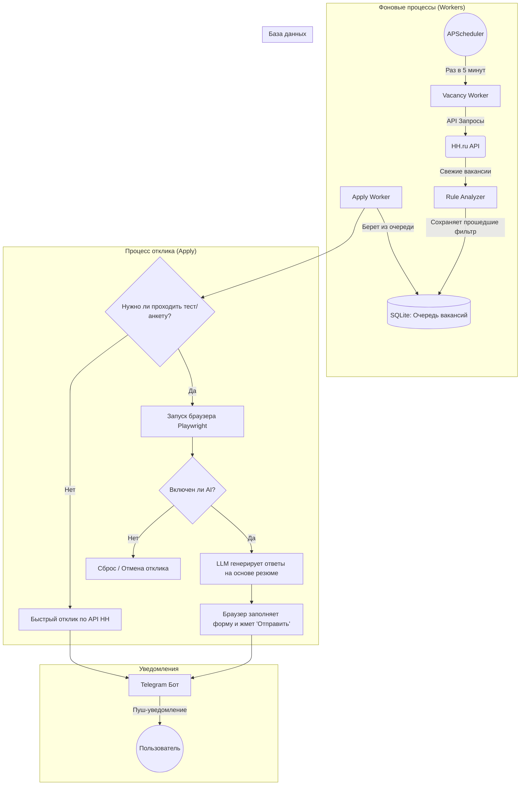

# 🏗 Архитектура и Устройство проекта (Как всё работает)

Этот документ объединяет техническую архитектуру и описание бизнес-логики бота. Он поможет разработчикам и энтузиастам быстро понять, как проект устроен "под капотом".

## 📌 Технологический стек
- **Язык:** Python 3.12+ (активное использование AsyncIO)
- **Telegram UI:** `aiogram` (v3+)
- **Парсинг и Автоматизация:** `playwright` (для сложных анкет), `beautifulsoup4`, `httpx` (для работы с API HH)
- **База данных:** `sqlalchemy[asyncio]` + `aiosqlite` (легковесная локальная SQLite)
- **Фоновые задачи:** `apscheduler`
- **Конфигурация:** `pydantic`, `pydantic-settings`
- **AI Интеграция:** Прямые HTTP-запросы через `httpx` к API, совместимым с OpenAI (Claude, Gemini и др.).

---

## 🗺️ Схема работы (Workflow)

Ниже представлена наглядная схема того, как данные проходят через систему от момента поиска до отправки отклика.

---

## 📂 Структура проекта (`hh-autoresponder/app/`)

Проект разделен на логические модули:

* **`main.py`** — Точка входа. Инициализирует БД, запускает планировщик `APScheduler` и Telegram-бота.
* **`config.py`** — Загрузка настроек из `.env` с помощью `pydantic-settings`.
* **`database.py`** — Настройка асинхронного движка SQLAlchemy.
* **`models/`** — ORM модели:
  - `vacancy.py` (сохраненные вакансии и их баллы)
  - `application.py` (история и статусы откликов)
  - `session.py` (хранение cookies/токенов для HH)
* **`bot/`** — Интерфейс Telegram:
  - `handlers.py` (роутеры сообщений, команды `/start`, кнопки управления)
  - `keyboards.py` (inline/reply клавиатуры)
* **`parsers/`** — Ядро взаимодействия с hh.ru:
  - `hh_api.py` (быстрый поиск и отклики через реверс-инжиниринг мобильного API)
  - `hh_playwright.py` (тяжелая работа: обработка сложных анкет, сопроводительных писем и тестов через headless-браузер)
  - `hh_login.py` / `manual_login.py` (первичная авторизация и сохранение сессии)
* **`workers/`** — Фоновая бизнес-логика (управляется `APScheduler`):
  - `scheduler.py` (настройка cron-задач)
  - `vacancy_worker.py` (периодический сбор новых вакансий)
  - `apply_worker.py` (обработка очереди вакансий и попытки отклика)
* **`ai/`** — Интеллектуальный слой:
  - `rule_analyzer.py` (оценка по правилам: поиск целевых и стоп-слов без траты токенов LLM)
  - `claude.py` (клиент LLM для динамических ответов на анкеты)
* **`utils/`** — Вспомогательные функции (анти-детект браузера, уведомления).

---

## 🏗️ Разбор ключевых компонентов

### 1. `Vacancy Worker` (Ищейка)
Фоновая задача, запускаемая каждые несколько минут. Она имитирует обычный поиск на `hh.ru` по вашим запросам (`SEARCH_QUERIES_RAW`).
*Главная фишка:* Использует мобильное API hh.ru, поэтому парсинг работает мгновенно и без капчи.

### 2. `Rule Analyzer` (Фильтр)
Новые вакансии пропускаются через ваши правила (без использования AI, что экономит токены):
- **Черный список (`NEGATIVE_KEYWORDS`)**: Вакансии со стоп-словами сразу отбрасываются.
- **Белый список (`TARGET_KEYWORDS`)**: При наличии целевых слов вакансия проходит первичный фильтр.
- **Оценка стека (`STACK_KEYWORDS`)**: Читается описание вакансии. За каждое совпадение навыков начисляются баллы (чем больше, тем выше приоритет в очереди).

### 3. База данных (SQLite)
Все подходящие вакансии сохраняются в SQLite, чтобы:
- Избежать дублирования откликов.
- Гарантировать сохранение состояния при перезапуске бота.

### 4. `Apply Worker` (Откликатор)
Второй фоновый процесс, который берет вакансии из БД по одной (соблюдая лимиты и имитируя человека):
- В большинстве случаев используется мгновенный отклик по API.
- Если требуется анкета/тест, задача передается Playwright.

### 5. `Playwright` + ИИ (Обработчик анкет)
Если API возвращает ошибку о необходимости прохождения теста:
1. Запускается невидимый (headless) браузер с сохраненными cookies.
2. Бот заходит на страницу отклика и парсит вопросы работодателя.
3. Вопросы отправляются в ИИ вместе с вашим текстовым резюме (`resume.txt`).
4. ИИ генерирует релевантные ответы, браузер заполняет текстовые поля и отправляет форму.

### 6. Стратегия использования LLM
LLM **НЕ** используются для поиска и базовой фильтрации (это делается детерминированно в `rule_analyzer`). LLM применяется строго для:
1. Ответов на открытые вопросы в анкетах работодателей.
2. Генерации осмысленных сопроводительных писем под конкретную вакансию.
