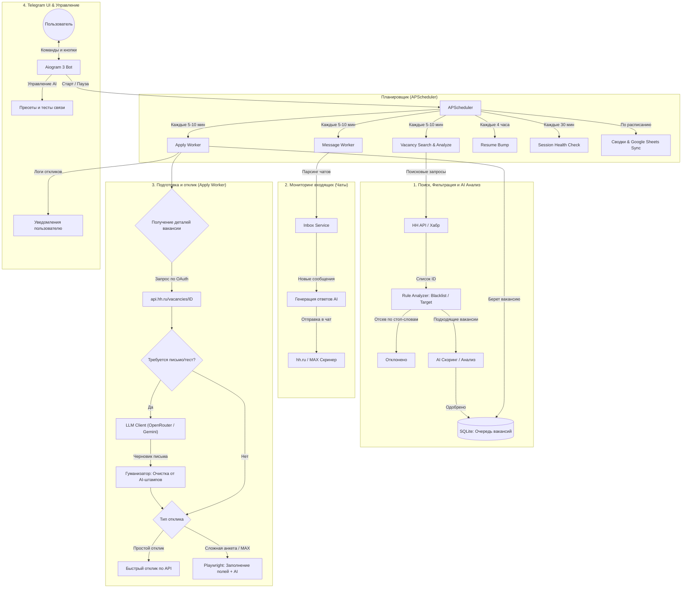

-- Active: 1790356018108@@127.0.0.1@3306
# 🏗 Архитектура и Устройство проекта (Как всё работает)

Этот документ объединяет техническую архитектуру, схему потоков данных и описание бизнес-логики бота. Он предназначен для разработчиков и пользователей, желающих детально понимать внутреннее устройство системы.

---

## 📌 Технологический стек

- **Язык и среда:** Python 3.12+ (полная асинхронность на базе `asyncio`).
- **Telegram UI:** `aiogram` (v3+) с использованием машины состояний (FSM) для интерактивной настройки параметров и ключей прямо в чате.
- **Интеграция с платформами вакансий:**
  - **HeadHunter:** Двухуровневая интеграция:
    1. Поиск вакансий через мобильное/публичное API.
    2. Извлечение детального описания и ключевых навыков через официальный API `api.hh.ru/vacancies/<id>` с авторизацией по OAuth Bearer токену (защита от блокировок Cloudflare и пустых HTML-страниц).
  - **Хабр Карьера:** REST API и парсинг.
  - **Автоматизация анкет и тестов:** `playwright` (Chromium) с инжекцией скриптов маскировки отпечатков браузера (anti-detect).
- **База данных:** `sqlalchemy[asyncio]` + `aiosqlite` (локальная легковесная SQLite-база с поддержкой конкурентного чтения).
- **Фоновые задачи:** `apscheduler` (асинхронный планировщик задач).
- **Конфигурация:** `pydantic`, `pydantic-settings` с валидаторами настроек и защитой от конфликтов моделей.
- **AI Интеграция:** 
  - 100% бесплатные LLM-провайдеры: **OpenRouter** (по умолчанию `deepseek/deepseek-v4-flash-0731:free`) и **Google Gemini** (бесплатный тариф Gemini Flash).
  - Поддержка рассуждающих моделей (thinking/reasoning fallback).
  - Увеличенный таймаут запросов (240 сек) для очередей бесплатных моделей.
  - Гуманизатор текста (Анти-ИИ) на базе алгоритмов очистки штампов (`digitaltraffic-detectai`).

---

## 🗺️ Схема работы (Workflow & Data Flow)

Ниже представлена детальная схема прохождения данных через подсистемы: от планировщика до отправки отклика и уведомления пользователя.

---

## 📂 Структура проекта (`hh-autoresponder/app/`)

* **`main.py`** — Главная точка входа. Инициализирует базу данных, настраивает и запускает планировщик фоновых процессов (`APScheduler`) и поллинг Telegram-бота (`aiogram`).
* **`config.py`** — Управление конфигурацией через `pydantic-settings`:
  - Загрузка переменных окружения из `.env`.
  - Независимое хранение ключей: `openrouter_api_key` и `gemini_api_key`.
  - Валидатор `@model_validator`: автоматическая защита конфигурации (предотвращает ошибочное использование моделей Gemini с эндпоинтом OpenRouter и фиксирует дефолт `deepseek/deepseek-v4-flash-0731:free`).
* **`database.py`** — Асинхронное подключение к SQLite (`aiosqlite` + `AsyncEngine`).
* **`models/`** — ORM-модели данных (`sqlalchemy`):
  - `vacancy.py`: сохраненные вакансии, рейтинг релевантности (скор стека).
  - `application.py`: журнал отправленных откликов, тексты писем, статусы работодателя.
  - `company.py` / `blacklist.py`: трекинг работодателей и черные списки.
  - `message.py`: хранение переписки с HR (чаты).
  - `ai_generation.py`: история генераций ИИ.
  - `session.py`: хранение cookies и авторизационных данных браузера.
* **`bot/`** — Слой взаимодействия с пользователем через Telegram:
  - `handlers.py`: обработчики команд `/start`, переключения режима, меню настроек ИИ (`AISettingsSG`), работа со скринерами.
  - `keyboards.py`: инлайн- и реплай-клавиатуры.
* **`parsers/`** — Модули взаимодействия с платформами (инкапсулированная логика работы с API и UI):
  - `hh_api.py`, `hh_oauth.py`: взаимодействие с HeadHunter API через OAuth Bearer токены.
  - `hh_chat.py`: парсинг входящих сообщений от рекрутеров.
  - `hh_login.py`, `habr_login.py`: автоматизация авторизации через Playwright.
  - `hh_playwright.py`, `habr_playwright.py`: автоматизация прохождения анкет, тестов и заполнения нестандартных форм отклика.
  - `max_screener.py`: интеграция со скринерами MAX (внешние тесты и вопросы).
* **Скрипты запуска (`*.bat` / `*.sh`)**: 
  - Настроены на максимальную отказоустойчивость: в Windows (`run_windows.bat`) автоматически проверяется наличие Python, скачивается официальный установщик, настраивается окружение (`uv`).
* **`workers/`** — Фоновые задачи (оркестрация бизнес-логики):
  - `scheduler.py`: инициализация и расписание всех задач (сводки, поиск, AI-анализ, проверка сессий).
  - `vacancy_worker.py`: плановый сбор и фильтрация свежих вакансий.
  - `apply_worker.py`: отправка откликов с рандомизированными задержками и регулярное поднятие резюме.
  - `message_worker.py`: периодический мониторинг входящих сообщений (чаты с рекрутерами).
* **`services/`** — Инфраструктурные сервисы:
  - `google_sheets.py`: выгрузка аналитики в Google Sheets.
  - `hh_status_sync.py`: синхронизация статусов откликов (прочитано, отказ, приглашение).
  - `inbox.py`: обработка входящих событий почты/сообщений.
* **`ai/`** — Интеллектуальный слой:
  - `rule_analyzer.py`: детерминированная фильтрация вакансий по ключевым словам и стеку (без вызова LLM).
  - `claude.py`: асинхронный HTTP-клиент к OpenAI-совместимому API (OpenRouter и Gemini). Включает логику тестирования подключения `test_connection()`, расширенный таймаут 240 сек, поддержку рассуждающих моделей (reasoning fallback), **и умный механизм обхода системных VPN/SOCKS4 прокси** (автоматическое игнорирование сломанного системного прокси без падений).
  - `humanizer.py`: пост-обработка сгенерированного текста (удаление ИИ-клише и неестественных конструкций).
* **`utils/`** — Вспомогательные утилиты (стелс-настройки браузера, генераторы случайных задержек).

---

## 🔬 Архитектура ключевых подсистем

### 1. Двухэтапный сбор и обогащение вакансий (Data Pipeline)
В отличие от примитивных парсеров, система разделяет процесс на два этапа:
1. **Быстрый поиск (Search API):** `Vacancy Worker` запрашивает списки вакансий по вашим ключевым фразам. Полученные карточки вакансий проверяются через локальный `Rule Analyzer`:
   - Если вакансия содержит стоп-слова из `NEGATIVE_KEYWORDS`, она немедленно отбрасывается (0 токенов потрачено).
   - Если стек совпадает с `TARGET_KEYWORDS`, вакансия сохраняется в БД в очередь на отклик.
2. **Обогащение данных через OAuth API:** Когда `Apply Worker` берет вакансию из очереди, бот выполняет запрос к `api.hh.ru/vacancies/<id>`, используя сохраненный OAuth Bearer токен из `data/hh_oauth_token.json`.
   - Это гарантирует получение полного текста описания, ключевых навыков и требований работодателя даже при блокировках Cloudflare на обычном сайте hh.ru.
   - ИИ получает исчерпывающий контекст для генерации письма высокой точности.

### 2. Бесплатный AI-слой и клиент нейросетей (`app/ai/claude.py`)
- **Единый OpenAI-совместимый интерфейс:** Клиент взаимодействует с эндпоинтами через стандартный протокол Chat Completions.
- **Поддержка двух провайдеров «из коробки»:**
  - **OpenRouter (по умолчанию):** Модели `deepseek/deepseek-v4-flash-0731:free` и другие. 100% бесплатные, высокая скорость, отличное качество на русском языке.
  - **Google Gemini:** Прямой доступ к API Gemini через OpenAI-совместимый эндпоинт `https://generativelanguage.googleapis.com/v1beta/openai/`.
- **Умная система отказоустойчивости (Smart Fallback):**
  В методе ядра `_call` реализована автоматическая обработка сетевых сбоев. Если выбранная модель недоступна (ошибка 503 Service Unavailable) или исчерпан лимит запросов (429 Rate Limit), система прозрачно переключается на массив резервных бесплатных моделей. Это предотвращает зависание бота в ожидании ответа.
- **Поддержка рассуждающих моделей (Reasoning Parsing):**
  Некоторые модели возвращают ход мыслей в поле `message.reasoning`, а финальный ответ в `message.content`. Если `content` пуст, клиент автоматически извлекает ответ из `reasoning`.
- **Специализированные задачи (Промпт-инжиниринг):**
  Помимо генерации сопроводительных писем, ИИ-клиент поддерживает:
  - `generate_screener_answer` / `generate_custom_idea_answer`: Разворачивание короткой "идеи" пользователя (например, "не работал с Docker") в полноценный вежливый деловой ответ для HR-скринера.
  - `analyze_sentiment`: Классификация тональности входящих сообщений работодателя (отказ, приглашение и т.д.).
  - `solve_captcha`: Использование Vision моделей для автоматического распознавания капчи.
- **Таймаут и устойчивость к пиковым нагрузкам:**
  Установлен таймаут `240.0` секунд на запросы к LLM, что исключает ошибки `ReadTimeout` при очередях на бесплатных шлюзах OpenRouter.
- **Встроенная самодиагностика (`test_connection`):**
  Метод отправляет короткий пинг-промпт и возвращает точное время ответа модели и статус авторизации ключа.

### 3. Гуманизатор текста (`app/ai/humanizer.py`)
Сгенерированное письмо передается в модуль гуманизации:
- Удаляются навязчивые шаблонные вступления («Меня зовут... и я с воодушевлением пишу вам...»).
- Удаляются искусственные канцеляризмы («Я обладаю обширным бэкграундом и глубокими компетенциями...»).
- Текст форматируется в лаконичном, профессиональном и уверенном тоне от первого лица.

### 4. Защита от обнаружения и антифрод
- **Динамический дневной лимит:** Каждый день генерируется случайное пороговое число откликов в интервале от `MIN` до `MAX`.
- **Рандомизированные задержки:** Паузы между шагами поиска и отправки варьируются в диапазоне от 30 до 180 секунд.
- **Тихие часы:** Автоматическая приостановка отправки откликов в ночное время (например, с 22:00 до 08:00) для поддержания правдоподобного графика соискателя.
- **Индивидуальный маршрут сетевого трафика:** Запросы к hh.ru выполняются с прямого локального IP без использования зарубежных прокси, вызывающих подозрения у систем защиты HeadHunter.

---

## 🛡️ Обеспечение надежности и автотесты

Вся ключевая бизнес-логика покрыта автоматическими тестами в директории `tests/`:
- **`test_model_selection.py`**: тестирование динамических клавиатур, валидации и изоляции API-ключей OpenRouter и Gemini.
- **`test_bot/`**: тестирование Telegram-команд `/start`, обработки коллбэков, FSM-сценариев ввода настроек.
- **`test_parsers/`**: проверка корректности парсинга вакансий и извлечения требований.
- **`test_ai/`**: тестирование работы `Rule Analyzer` и клиента `ClaudeClient` с моками внешних API.
