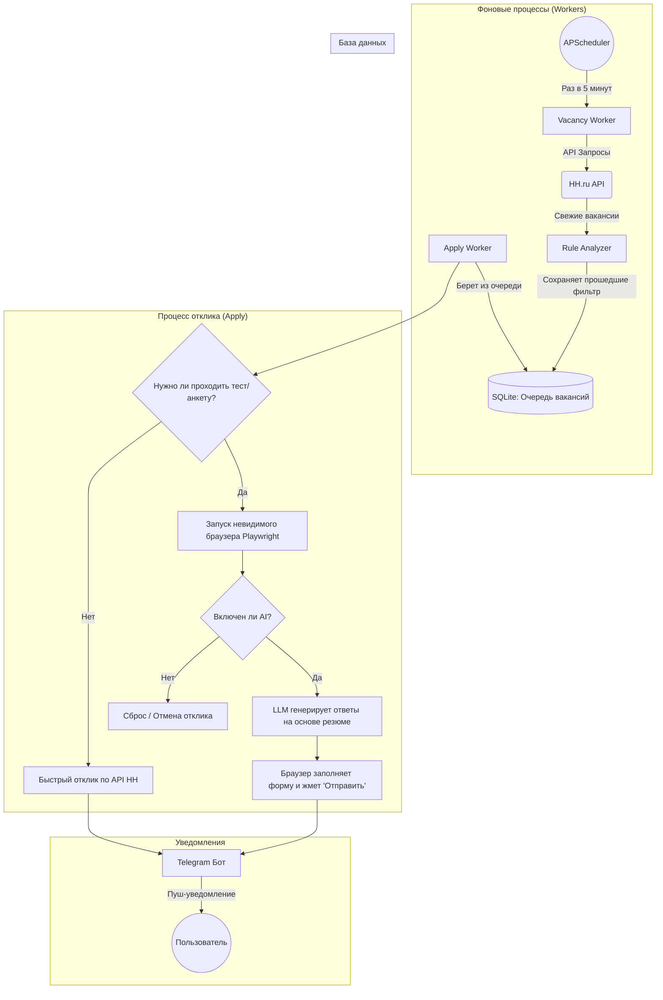

# ⚙️ Как работает бот (Архитектура для людей)

Этот документ написан специально для разработчиков (и просто интересующихся), чтобы быстро понять, как устроен проект "под капотом", без необходимости сразу лезть в исходный код.

---

## 🗺️ Схема работы (Workflow)

Ниже представлена наглядная схема того, как данные проходят через систему от момента поиска до отправки отклика.

---

## 🏗️ Разбор ключевых компонентов

### 1. `Vacancy Worker` (Ищейка)
Это фоновая задача, которая запускается каждые несколько минут (настраивается в `.env`). Она имитирует обычный поиск на `hh.ru` по вашим ключевым словам (`SEARCH_QUERIES_RAW`). 
*Главная фишка:* Worker использует официальное (но закрытое мобильное) API hh.ru, поэтому парсинг работает мгновенно и без капчи.

### 2. `Rule Analyzer` (Фильтр)
Когда Ищейка находит новые вакансии, они пропускаются через сито ваших правил:
- **Черный список (`NEGATIVE_KEYWORDS`)**: Если в названии вакансии есть слово "Стажер" или "1C", вакансия сразу летит в мусорку.
- **Белый список (`TARGET_KEYWORDS`)**: Если вакансия содержит слово "Python" или "Backend", она одобряется.
- **Оценка стека (`STACK_KEYWORDS`)**: Читается всё описание вакансии. За каждое совпадение (например, "FastAPI", "Docker", "PostgreSQL") вакансия получает баллы. Чем больше баллов, тем приоритетнее вакансия в очереди на отклик.
*Важно: этот этап работает на чистом Python без использования ИИ, что позволяет экономить деньги (токены).*

### 3. База данных (SQLite)
Все подходящие вакансии складываются в локальную легковесную базу данных. Это сделано для того, чтобы бот:
а) Не откликался на одну и ту же вакансию дважды.
б) Мог продолжить работу с того же места, если вы случайно перезагрузите компьютер.

### 4. `Apply Worker` (Откликатор)
Второй фоновый процесс, который берет вакансии из Базы Данных по одной (чтобы не нарушать лимиты hh.ru и имитировать человека) и пытается на них откликнуться:
- В 80% случаев для отклика достаточно нажать одну кнопку через API.
- В 20% случаев работодатель прикрепляет к вакансии **тест или анкету** (с вопросами вида "Сколько лет вы работаете с Python?" или "Ваши ожидания по ЗП").

### 5. `Playwright` + ИИ (Обработчик анкет)
Если API возвращает ошибку "требуется пройти тест", в дело вступает "тяжелая артиллерия":
1. Бот "в фоне" (без открытия окон) открывает полноценный браузер Chrome.
2. Подкладывает в него сохраненные cookies (которые вы создали скриптом `login_linux`).
3. Заходит на страницу отклика.
4. Парсит текст вопросов, которые задал работодатель.
5. Отправляет эти вопросы в ИИ (например, ChatGPT или Claude), прикрепляя ваше текстовое резюме (`resume.txt`).
6. ИИ возвращает логичные ответы, бот вставляет их в текстовые поля в браузере и нажимает кнопку "Отправить".

### 6. `Telegram Bot` (Панель управления)
Всё общение с вами происходит через бота в Telegram. Он нужен для:
- Получения статистики ("Отправлен отклик на позицию X").
- Управления (Кнопки "Включить автоотклики", "Выключить").
- Установки "тихих часов", чтобы бот не присылал вам уведомления ночью.
